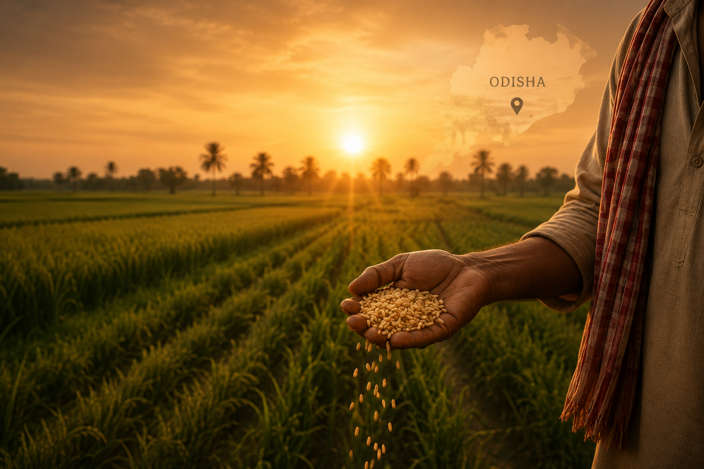

# 🌾 Mye Farm

A premium heritage agriculture platform connecting indigenous farming communities of Odisha directly with modern kitchens.



## 🚀 Live Demo

Coming Soon...

## ✨ Features

- 🌾 Premium Hero Section with custom Odisha heritage artwork
- 📊 Impact statistics section
- ❤️ Story-driven brand narrative
- 🌱 Heritage product showcase
- 📱 WhatsApp ordering integration
- 🎨 Responsive modern UI
- ⚡ Smooth animations using Framer Motion
- 📌 Sticky navigation with smooth scrolling

---

## 🛠️ Built With

- React
- Vite
- Tailwind CSS
- Framer Motion

---

## 📂 Project Structure

```text
src/
│
├── components/
│   ├── layout/
│   │   ├── Navbar.jsx
│   │   └── Footer.jsx
│
├── pages/
│   └── home/
│       └── sections/
│           ├── Hero.jsx
│           ├── Statistics.jsx
│           ├── WhyChooseUs.jsx
│           ├── OurStory.jsx
│           ├── FeaturedProducts.jsx
│           ├── LogisticsPipeline.jsx
│           └── ContactSection.jsx
│
├── utils/
│   └── whatsappLink.js
```

---

## 📦 Installation

Clone the repository:

```bash
git clone https://github.com/AnukritiPandey11/mye-farm.git
```

Install dependencies:

```bash
npm install
```

Run locally:

```bash
npm run dev
```

---

## 🌍 Vision

Mye Farm aims to preserve indigenous grains, support local farming communities, and create transparent farm-to-kitchen supply chains across India.

---

## 👩‍💻 Developer

Built by **Anukriti Pandey**

- GitHub: https://github.com/AnukritiPandey11
- LinkedIn: Add your LinkedIn link here

---

## 📜 License

This project was developed for Mye Farm and is intended for business use.
